# device_systems

API REST construida con FastAPI, SQLAlchemy y Python para gestionar usuarios del sistema device_systems.
Esta es la version 3.0 del proyecto, donde se reemplazo el almacenamiento en memoria por una base de
datos real usando SQLAlchemy con SQLite, manteniendo el CRUD completo de las versiones anteriores.

---

## Que hace este proyecto

device_systems permite crear, consultar, actualizar y eliminar usuarios de un sistema.
Cada usuario tiene nombre, correo, rol, estado y fecha de creacion. Los datos persisten en una
base de datos real, lo que significa que sobreviven reinicios del servidor. La API valida
automaticamente los datos de entrada, responde con codigos HTTP correctos y organiza su
logica en capas separadas.

---

## Tecnologias utilizadas

- Python 3.13
- FastAPI
- SQLAlchemy
- Pydantic v2
- SQLite
- Uvicorn
- uv como gestor de paquetes

---

## Como instalarlo

```bash
git clone <url-del-repositorio>
cd device_systems
uv sync
```

Las dependencias del proyecto estan definidas en `pyproject.toml`.

---

## Como correr el servidor

```bash
uv run uvicorn main:app --reload
```

La primera vez que corre el servidor se crea automaticamente el archivo `device_systems.db`
en la raiz del proyecto con la tabla `users` lista para usar.

Una vez corriendo lo encuentras en:

- API: http://127.0.0.1:8000
- Swagger UI: http://127.0.0.1:8000/docs
- ReDoc: http://127.0.0.1:8000/redoc

---

## Estructura del proyecto

```
device_systems/
├── app/
│   ├── database/
│   │   └── connection.py        # Engine, SessionLocal y Base declarativa
│   ├── dependencies/
│   │   └── database_dependency.py # Dependencia que entrega la sesion de BD
│   ├── models/
│   │   └── user_model.py        # Modelo SQLAlchemy que representa la tabla users
│   ├── routes/
│   │   └── user_routes.py       # Definicion de endpoints
│   ├── schemas/
│   │   └── user_schema.py       # Modelos Pydantic de entrada y salida
│   └── services/
│       └── user_service.py      # Logica de negocio con queries SQLAlchemy
├── main.py
├── pyproject.toml
├── device_systems.db            # Base de datos SQLite generada automaticamente
└── README.md
```

---

## Diferencia entre modelo SQLAlchemy y schema Pydantic

Son dos cosas distintas con responsabilidades distintas que trabajan juntas.

El **modelo SQLAlchemy** representa la tabla en la base de datos. Define las columnas,
los tipos de datos y las restricciones. SQLAlchemy lo usa para crear la tabla y ejecutar
las consultas. No sabe nada de la API.

El **schema Pydantic** define la forma que tienen los datos que entran y salen por la API.
Pydantic lo usa para validar que los datos del cliente sean correctos antes de tocar la BD,
y para darle forma a lo que la API devuelve. No sabe nada de la base de datos.

En resumen: SQLAlchemy habla con la BD, Pydantic habla con el cliente. FastAPI los conecta.

---

## Capturas de la estructura del proyecto


---

## Endpoints disponibles

| Metodo | Ruta                      | Que hace                             | Codigo exitoso |
|--------|---------------------------|--------------------------------------|----------------|
| GET    | /                         | Confirma que el servidor esta vivo   | 200            |
| GET    | /users                    | Trae todos los usuarios              | 200            |
| GET    | /users?role=admin         | Filtra usuarios por rol              | 200            |
| GET    | /users?is_active=true     | Filtra por estado                    | 200            |
| GET    | /users?order_by=created_at| Ordena por fecha de creacion         | 200            |
| GET    | /users/{user_id}          | Trae un usuario por su ID            | 200            |
| POST   | /users                    | Crea un usuario nuevo                | 201            |
| PUT    | /users/{user_id}          | Reemplaza un usuario completo        | 200            |
| PATCH  | /users/{user_id}          | Modifica campos especificos          | 200            |
| DELETE | /users/{user_id}          | Elimina un usuario                   | 204            |

---

## Codigos de estado usados

| Codigo | Cuando ocurre                                      |
|--------|----------------------------------------------------|
| 200    | Operacion exitosa                                  |
| 201    | Usuario creado exitosamente                        |
| 204    | Usuario eliminado, sin cuerpo de respuesta         |
| 400    | Correo duplicado o PATCH enviado sin campos        |
| 404    | Usuario no encontrado                              |
| 422    | Datos invalidos segun las reglas de Pydantic       |

---

## Ejemplos de peticiones y respuestas

### GET /users

```http
GET http://127.0.0.1:8000/users
```

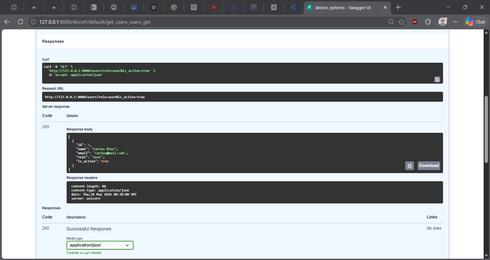

---

### GET /users/{user_id}

```http
GET http://127.0.0.1:8000/users/1
```

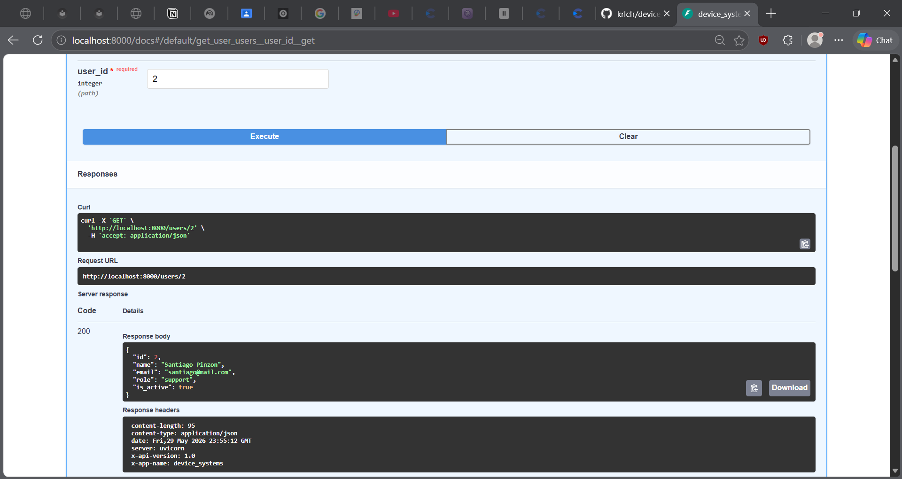

---

### GET /users?role=admin

```http
GET http://127.0.0.1:8000/users?role=admin
```

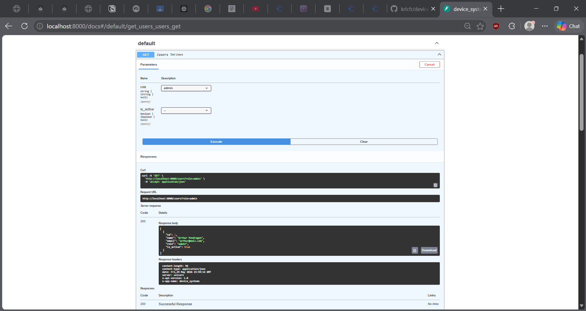

---

### GET /users?is_active=false

```http
GET http://127.0.0.1:8000/users?is_active=false
```

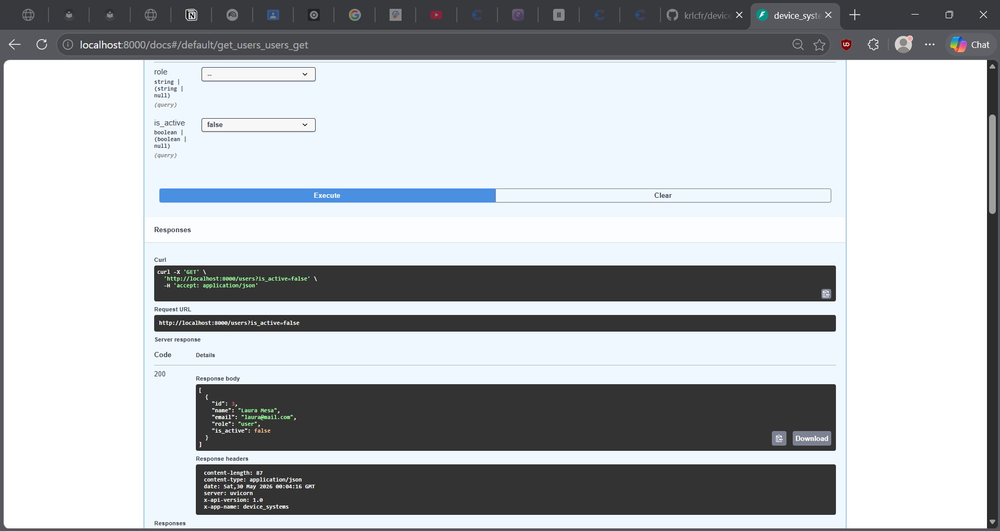

---

### POST /users

Body:
```json
{
  "name": "Aleja Torres",
  "email": "aleja@mail.com",
  "role": "user",
  "is_active": true
}
```

Respuesta exitosa (201):
```json
{
  "id": 1,
  "name": "Aleja Torres",
  "email": "aleja@mail.com",
  "role": "user",
  "is_active": true,
  "created_at": "2024-01-15T10:30:00"
}
```

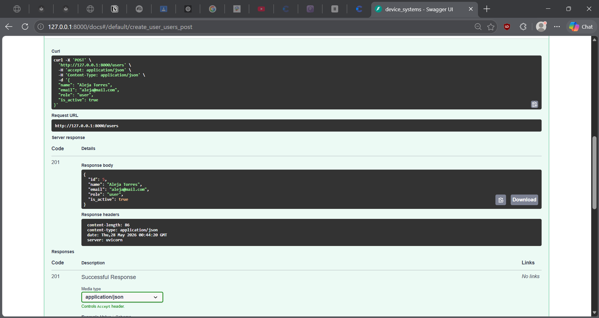

---

### PUT /users/{user_id}

Body:
```json
{
  "name": "Aleja Torres Updated",
  "email": "aleja_updated@mail.com",
  "role": "support",
  "is_active": true
}
```

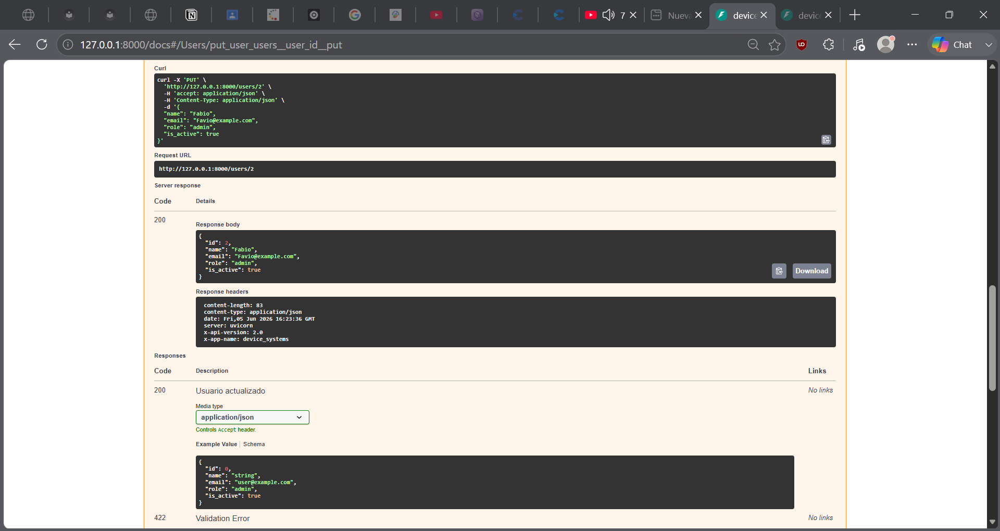

---

### PATCH /users/{user_id}

Body (solo los campos que quieres cambiar):
```json
{
  "role": "support"
}
```

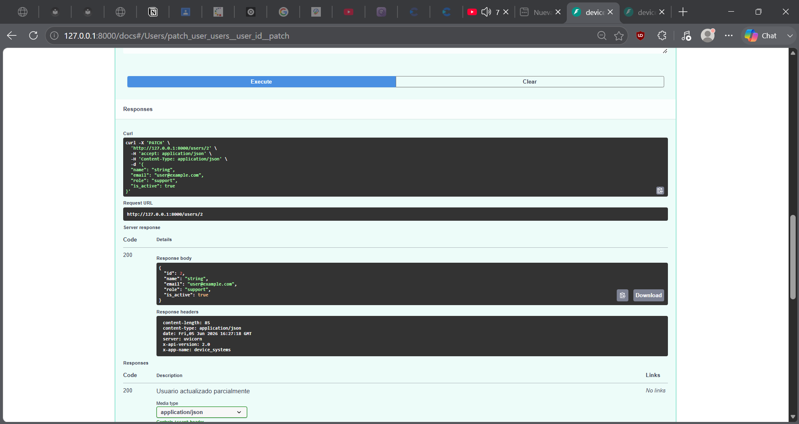

---

### DELETE /users/{user_id}

```http
DELETE http://127.0.0.1:8000/users/1
```

Responde con 204 y sin cuerpo.

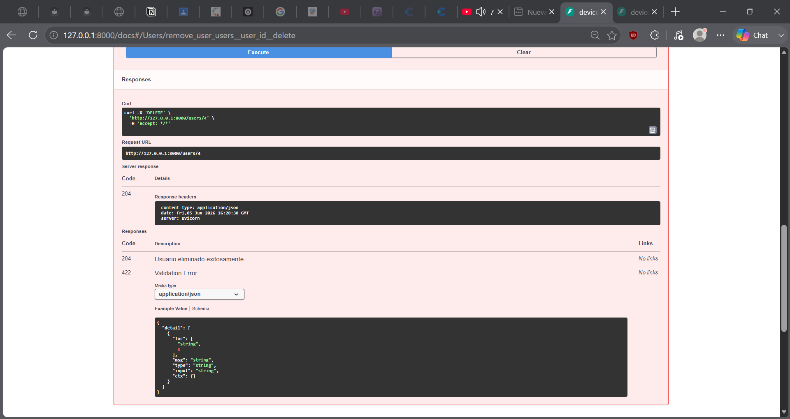

---

## Errores controlados

### Usuario no encontrado (404)

```json
{
  "detail": "Usuario no encontrado"
}
```

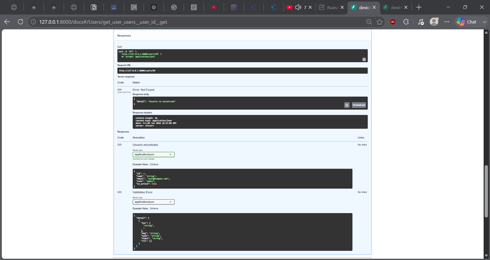

---

### Correo duplicado (400)

```json
{
  "detail": "El correo ya esta registrado"
}
```


---

### PATCH sin campos (400)

```json
{
  "detail": "Debes enviar al menos un campo para actualizar"
}
```

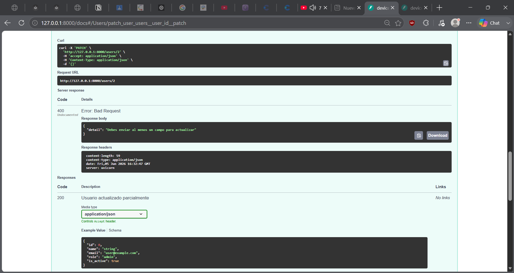

---

### Datos invalidos (422)

```json
{
  "detail": [
    {
      "type": "string_too_short",
      "loc": ["body", "name"],
      "msg": "String should have at least 3 characters"
    }
  ]
}
```


---

## Capturas de Swagger UI y ReDoc

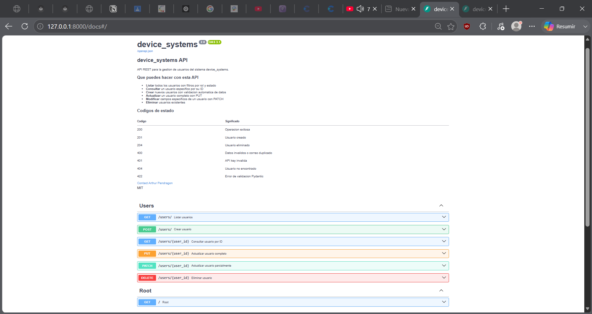

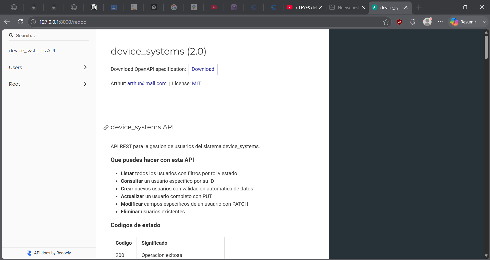

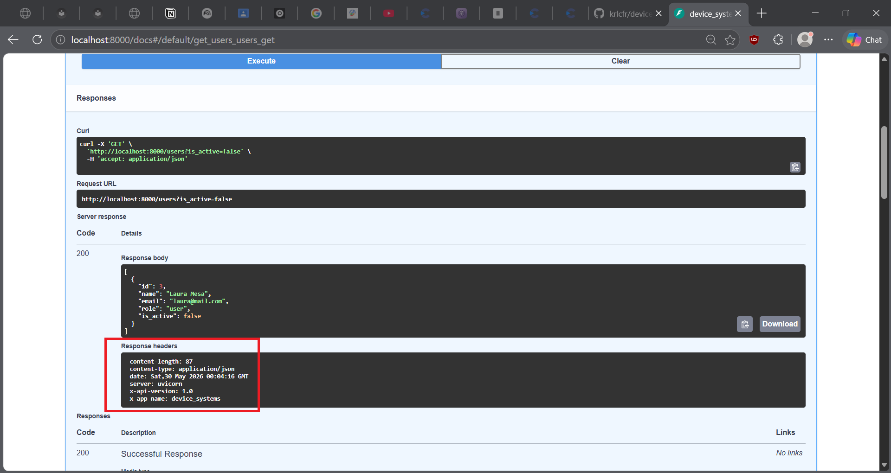

---

## Captura de la base de datos generada


---

## Como funciona la sesion de base de datos

Cada request recibe su propia sesion de base de datos gracias a la dependencia `get_db`.
FastAPI la crea antes de entrar al endpoint, la pasa como parametro y la cierra automaticamente
cuando el request termina, sin importar si hubo error o no. Esto garantiza que no queden
conexiones abiertas consumiendo recursos.

```python
def get_db():
    db = SessionLocal()
    try:
        yield db
    finally:
        db.close()
```

---

## Reflexion

Pasar de datos en memoria a una base de datos real cambia completamente la naturaleza del proyecto.
Con listas, los datos desaparecen cada vez que el servidor se reinicia. Con SQLAlchemy y SQLite,
los datos persisten en disco y sobreviven cualquier reinicio. El ORM hace que trabajar con la base
de datos se sienta natural en Python, sin escribir SQL directamente. La separacion entre el modelo
SQLAlchemy y el schema Pydantic mantiene el codigo limpio: cada uno hace su trabajo sin meterse
en el del otro. SQLAlchemy habla con la BD, Pydantic habla con el cliente, y FastAPI los conecta.

