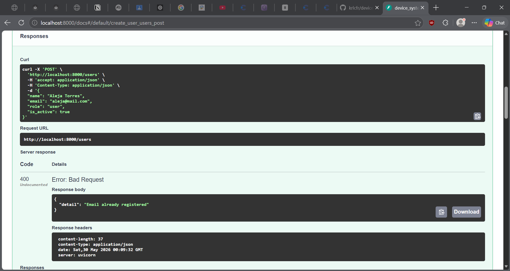
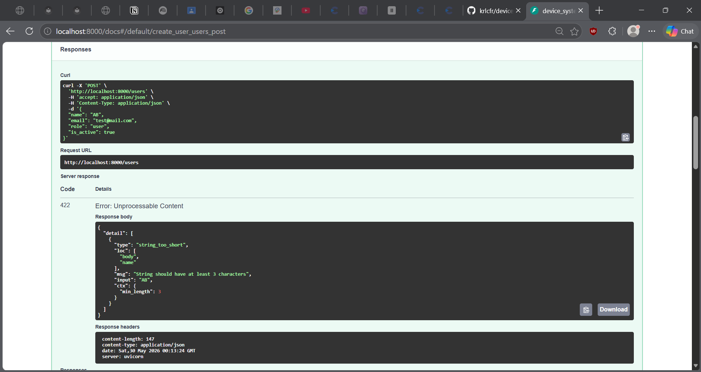

# device_systems

Una API REST construida con FastAPI y Python para gestionar usuarios de un sistema de dispositivos.

---

## Que hace este proyecto

device_systems es una API backend que permite crear y consultar usuarios. Cada usuario tiene nombre,
correo, rol y estado. La API valida automaticamente que los datos lleguen correctos, devuelve
respuestas estructuradas y agrega cabeceras personalizadas en cada respuesta.

---

## Lo que necesitas para correrlo

- Python 3.13 o superior
- uv como gestor de paquetes

---

## Como instalarlo

Clona el repo e instala las dependencias:

```bash
git clone <url-del-repositorio>
cd device_systems
uv sync
```

---

## Como correr el servidor

```bash
uv run uvicorn main:app --reload
```

Una vez corriendo lo encuentras en:

- API: http://127.0.0.1:8000
- Documentacion interactiva: http://127.0.0.1:8000/docs

---

## Endpoints disponibles

| Metodo | Ruta                    | Que hace                              |
|--------|-------------------------|---------------------------------------|
| GET    | /                       | Confirma que el servidor esta vivo    |
| GET    | /users                  | Trae todos los usuarios               |
| GET    | /users?role=admin       | Filtra usuarios por rol               |
| GET    | /users?is_active=true   | Filtra usuarios activos o inactivos   |
| GET    | /users/{user_id}        | Trae un usuario por su ID             |
| POST   | /users                  | Crea un usuario nuevo                 |

---

## Ejemplos de uso

### Traer todos los usuarios

```http
GET http://127.0.0.1:8000/users
```


---

### Traer un usuario por ID

```http
GET http://127.0.0.1:8000/users/1
```


---

### Filtrar por rol

```http
GET http://127.0.0.1:8000/users?role=admin
```


---

### Filtrar por estado

```http
GET http://127.0.0.1:8000/users?is_active=false
```


---

### Crear un usuario

```http
POST http://127.0.0.1:8000/users
Content-Type: application/json
```

Body que debes mandar:
```json
{
  "name": "Aleja Torres",
  "email": "aleja@mail.com",
  "role": "user",
  "is_active": true
}
```

Respuesta cuando todo va bien (201):
```json
{
  "id": 5,
  "name": "Aleja Torres",
  "email": "aleja@mail.com",
  "role": "user",
  "is_active": true
}
```


---

### Intentar crear un usuario con email repetido

Si mandas el mismo correo dos veces, la API lo rechaza con un 400:

```json
{
  "detail": "Email already registered"
}
```



---

### Mandar datos invalidos

Si el nombre tiene menos de 3 caracteres o el rol no existe, la API responde con un 422:

```json
{
  "detail": [
    {
      "type": "string_too_short",
      "loc": ["body", "name"],
      "msg": "String should have at least 3 characters"
    }
  ]
}
```



---

## Cabeceras que devuelve la API

Cada respuesta incluye estas dos cabeceras personalizadas:

```
X-App-Name: device_systems
X-API-Version: 1.0
```

Las puedes ver en la seccion Response Headers del Swagger despues de ejecutar cualquier endpoint.


---

## Reglas de validacion

| Campo     | Regla                                         |
|-----------|-----------------------------------------------|
| name      | Obligatorio, minimo 3 caracteres              |
| email     | Debe tener formato de correo, sin repetidos   |
| role      | Solo acepta: admin, support o user            |
| is_active | Verdadero o falso, por defecto llega en true  |

---

## Reflexion

Trabajar con FastAPI fue una experiencia bastante directa. La combinacion con Pydantic hace que
no tengas que escribir validaciones a mano, el framework las maneja solo y los errores que devuelve
son claros y utiles. La documentacion interactiva que genera automaticamente en /docs acelera
mucho el proceso de probar y entender como funciona cada endpoint sin necesidad de herramientas
externas. Es un stack que tiene mucho sentido para construir APIs de forma rapida y ordenada.

